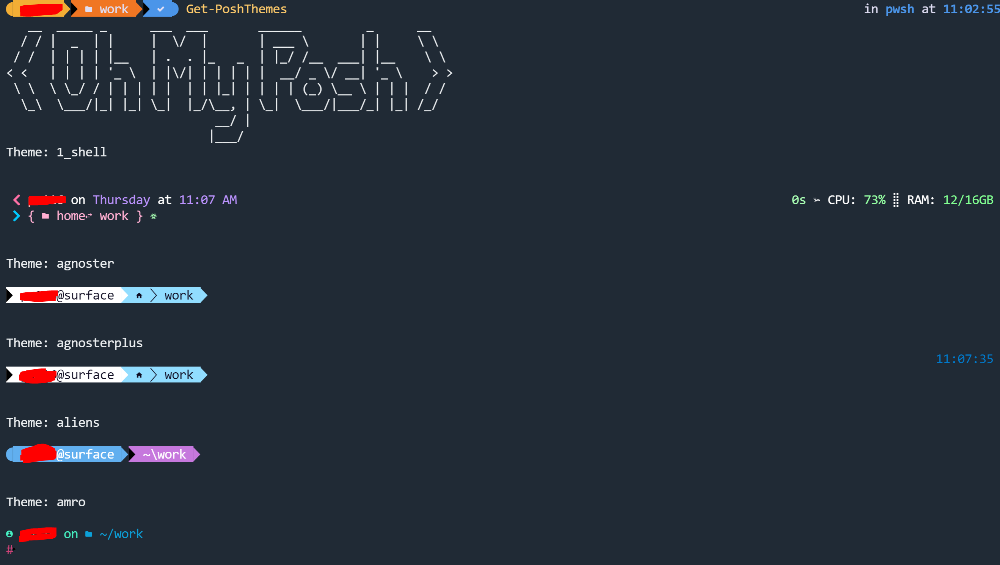
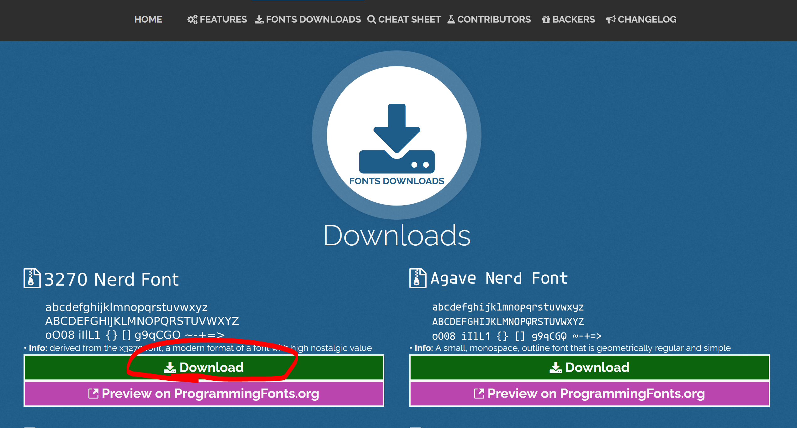
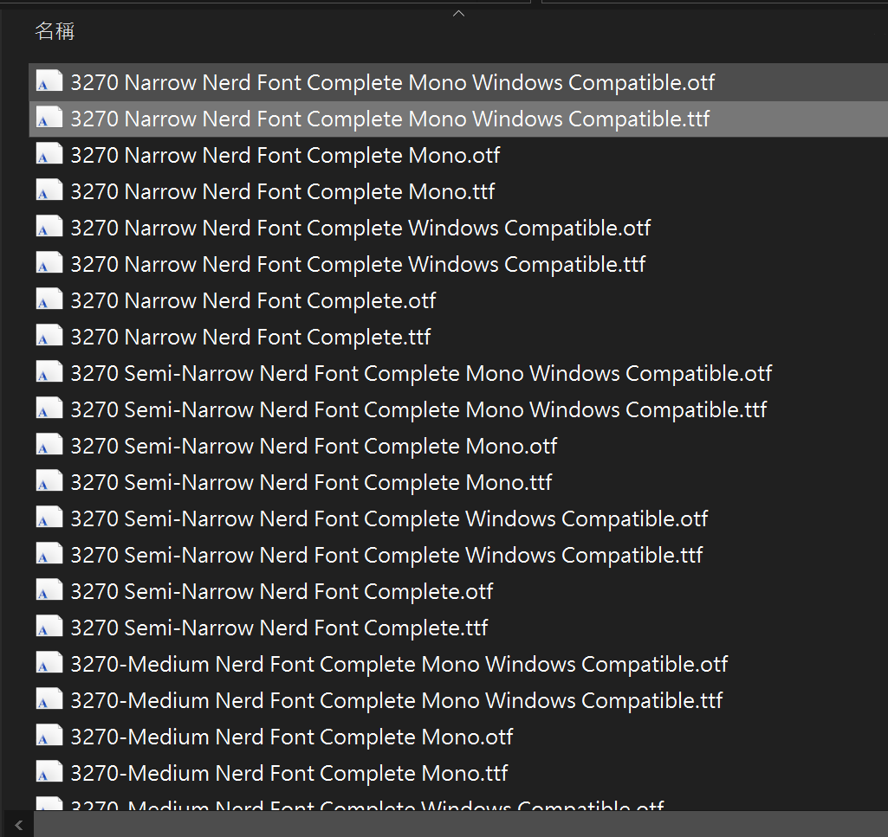
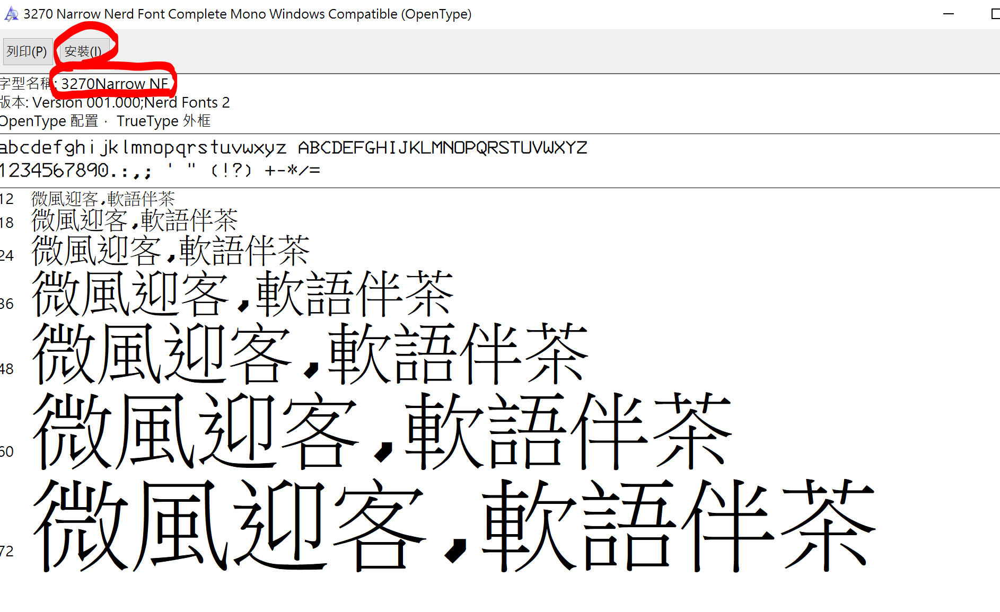
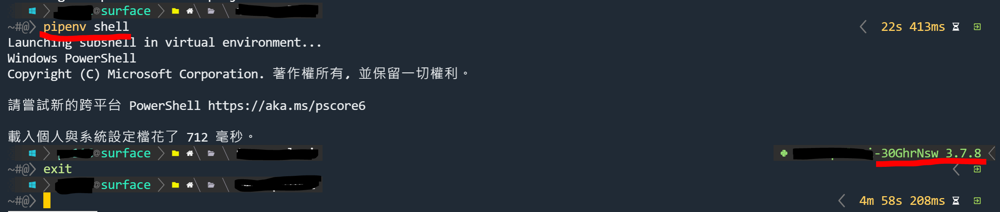
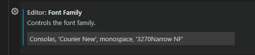
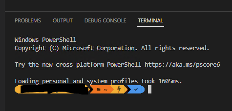
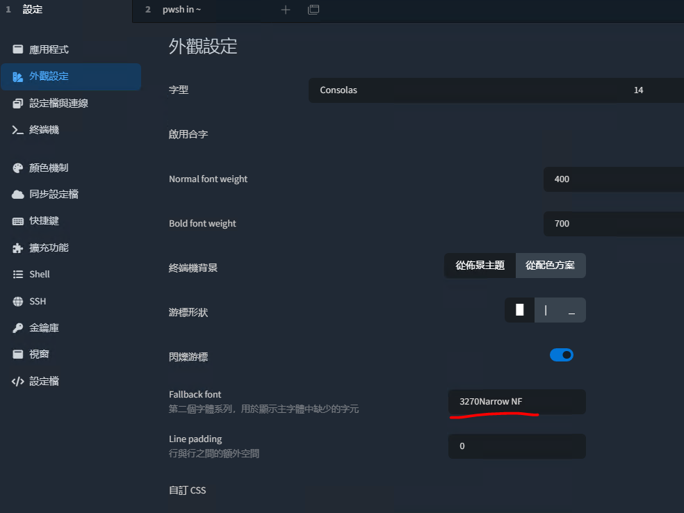

# 全能 PowerShell 改造王

Keywords: oh-my-posh, Tabby, Terminus, VSCode, Python, venv

幾個小步驟改造 Windows 的命令列環境

## Scoop

可選，這篇文章中介紹的工具都能從 [Scoop](https://scoop.sh/) 安裝，如果沒有使用過類似工具的話可以參考這篇介紹。

- [Windows 套件管理工具 - Scoop](https://www.gss.com.tw/blog/windows-%E5%A5%97%E4%BB%B6%E7%AE%A1%E7%90%86%E5%B7%A5%E5%85%B7-scoop)

安裝方式只需要打開 PowerShell 執行這兩行

```powershell
> Set-ExecutionPolicy RemoteSigned -Scope CurrentUser
> irm get.scoop.sh | iex
```

## Oh My Posh

今天主角 [Oh My Posh](https://github.com/jandedobbeleer/oh-my-posh) 是一個可以自定義命令列的工具，也有非常多事先寫好的[風格](https://ohmyposh.dev/docs/themes)可以直接套用。

目前已經有在 scoop 的 [main bucket](https://github.com/ScoopInstaller/Main/blob/master/bucket/oh-my-posh.json) ，可以直接這樣搜尋與安裝。

```powershell
> scoop search oh-my-posh
'main' bucket:
    oh-my-posh (8.5.2)
> scoop install oh-my-posh
```

安裝後執行下列命令啟動。

```powershell
> oh-my-posh init pwsh | Invoke-Expression
```

再來需要寫進腳本中讓每次啟動 PowerShell 時可以自動載入，如果已經有安裝 VSCode 可以這樣打開。

```powershell
> code $PROFILE
```

也可以手動在文件目錄下新增，後續會修改這個檔案加入其他的風格設定。

`C:\Users\<user name>\Documents\WindowsPowerShell\Microsoft.PowerShell_profile.ps1`

### 字型問題

安裝完成之後可以執行各種風格的預覽

```powershell
> Get-PoshThemes
```



如果沒有先安裝 Nerd Fonts 的話應該會發現有很多缺字的狀況。Oh My Posh 正在測試一個[自動安裝字型](https://ohmyposh.dev/docs/installation/fonts)的功能，不過會需要管理員權限，如果運作正常的話可以跳過下列手動安裝的步驟。

### 手動安裝 Nerd Fonts

在 Nerd Fonts [下載頁面](https://www.nerdfonts.com/font-downloads) 選擇字型，這次選用 3270 。



解壓縮後點選 .ttf 檔案可以預覽並安裝。



如果有其他的工具需要指定字型，例如下面介紹的 Tabby 或 VSCode 那就需要記得這個字型名稱。



安裝後重新啟動 PowerShell 應該就能看到正常的字體了。

### 風格設定

可以在啟動時加入 `--config` 指定挑選的風格，如果是使用 Scoop 安裝會像在下列的路徑中。

```powershell
> oh-my-posh init pwsh --config C:\Users\<user name>\scoop\apps\oh-my-posh\current\themes\slim.omp.json | Invoke-Expression
```

可以選用或修改成符合自己工作環境的風格，例如 Python 常使用 venv ，可以修改 `slim.omp.json` 這個風格，在啟用虛擬環境時會在右方顯示的名稱，其他 Node.js 或 Git 都有支援。



## 其他工具設定

### VSCode

在 `editor.fontFamily` 中加入剛才安裝的 Nerd Fonts 名稱



內建的 terminal 能正常顯示



## Tabby

原本的 Terminus ，如果執行的 shell 沒有正常顯示字型可以在 `Fallback font` 中新增。



## Reference

- [我的Terminal 設定方式 - Windows Terminal & ohmyposh](https://thomascsd.github.io/blog/2022-05-20-WindowTeminalAndOhMyPosh)
- [如何打造一個華麗又實用的 PowerShell 命令輸入環境](https://blog.miniasp.com/post/2021/11/24/PowerShell-prompt-with-Oh-My-Posh-and-Windows-Terminal)
